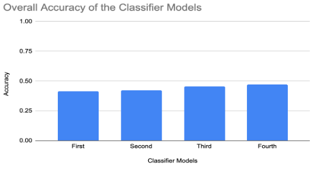
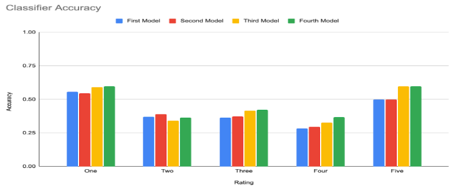

# Sentiment-Analysis-of-RateMyProfessor-Reviews

### Overview:
This project aims to analyze sentiment in reviews from RateMyProfessor.com using a Naive Bayes classifier, enhanced with selective sampling and trigram frequency distribution to improve accuracy. The objective is to accurately distinguish between individual ratings (1 to 5) through detailed textual analysis of the reviews.

### Background:
Sentiment Analysis is a Natural Language Processing (NLP) technique used to analyze and classify emotions in text. It has broad applications in understanding public opinion and customer feedback. This project aims to leverage sentiment analysis to analyze educational reviews, providing insights for prospective students and institutions.

### Installation:
To set up the project on your local machine, follow these steps:
```
# Go to the project directory 
cd /path/to/repo/project 

# Install the required dependencies
pip install nltk

# Download necessary NLTK data (to use 'word_tokenize')
import nltk
nltk.download('punkt')

# Run the project (ensure you have the necessary data files in the correct directories)
python main.py
```

### Methodology:
## Data Collection
- Collected 55,000 reviews from RateMyProfessor.com using web scraping tools (Selenium, Beautiful Soup, and WebDriver).
- Reviews were stored as text files categorized by ratings (OneRate.txt, TwoRate.txt, ThreeRate.txt, FourRate.txt, FiveRate.txt).

## Initial Analysis
- Frequency Distribution: Identified language patterns in reviews.
- Naive Bayes Classifier: Trained an initial model using a dataset of 5,000 reviews, with 1,000 reviews for each rating category (1 to 5).

### Iterative Improvements:
1. Trigram Frequency Distribution: Improved accuracy by considering the two preceding words based on the predicted label from the Naive Bayes classifier.
2. Selective Sampling: Used trigram frequency distributions to selectively sample and obtain more useful training data.
3. Combined Approach: Merged trigram frequency distribution and selective sampling for final improvements.

### Results:
The iterative process showed gradual improvements in classifier accuracy:
1. First Iteration: 42.49% (used only the Naive Bayes classifier).
2. Second Iteration: 43.4% (applied trigram frequency distribution on the predicted labels from the classifier).
3. Third Iteration: 45.46% (recollected training data through selective sampling and then used the Naive Bayes classifier).
4. Fourth Iteration: 47.05% (combined the Naive Bayes classifier with the trigram frequency distribution).


Overall Accuracy of the Classifier through each process:



Classifier's accuracy in accurately predicting reviews with each rating:


### Challenges:
Runtime Delays: Optimized the scraping process to handle large datasets efficiently.
Vague and Sarcastic Reviews: The classifier struggled to accurately categorize subtle and sarcastic reviews. Additionally, the presence of five distinct rating categories (1 to 5), as opposed to the traditional binary sentiment analysis (positive and negative), made improving the classifier's accuracy significantly more challenging.

### Future Work:
- Implement additional NLP methods to enhance the model’s accuracy.
- Develop a domain-independent model for broader applicability.
